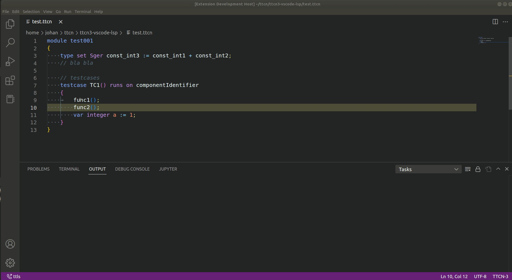

### ttls
ttls is a simple language server implementation for TTCN-3. This repo contains both the server itself and a vscode client extension to communicate with it. The server is written in Python using the `pygls` library for communcation with the client, and ANTLR4 for parsing the .ttcn files.

